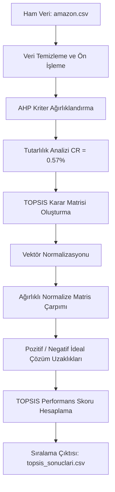

# Ürün Geliştirme Projelerinde Veri Analitiği Kullanılarak Özellik Önceliklendirme ve Kıyaslama Modeli

<p align="center">
  
  
  
  
</p>

Bu proje, e-ticaret pazarındaki rakip ürünlerin kullanıcı etkileşimi ve finansal performans verilerini analiz ederek, **yeni geliştirilecek ürünlerde hangi özelliklere öncelik verilmesi gerektiğini** belirleyen karar destek sistemidir. Kaggle üzerindeki **Amazon Sales Dataset** (1462 ürün) verileri kullanılarak Çok Kriterli Karar Verme (ÇKKV) yöntemlerinden **AHP (Analitik Hiyerarşi Süreci)** ve **TOPSIS** algoritmaları üzerine inşa edilmiştir.

---

## 📌 Proje Genel Bakış ve Metodoloji

Projenin temel amacı, sezgisel ürün kararları yerine, büyük veri analitiğini karar verme süreçlerine entegre etmektir. Süreç, aşağıdaki analitik iş akışı (pipeline) üzerinden yürütülür:



---

## 📊 Karar Verme Kriterleri ve AHP Ağırlıkları

AHP ikili karşılaştırma matrisine dayalı olarak hesaplanan kriterlerin önem ağırlıkları ve yönelimleri (Fayda/Maliyet) aşağıdaki şekildedir:

| Kriter Kodu | Kriter Adı | Türü | AHP Ağırlığı | Açıklama |
| :--- | :--- | :---: | :---: | :--- |
| **K1** | Kullanıcı Memnuniyeti (Rating) | **Fayda (Benefit)** | `%48` | Ürünün ortalama yıldız puanı. |
| **K2** | Kullanıcı İlgisi (Rating Count) | **Fayda (Benefit)** | `%26` | Ürüne yapılan toplam yorum/değerlendirme sayısı. |
| **K3** | İndirim Avantajı (Discount Percentage) | **Fayda (Benefit)** | `%13` | Ürünün normal fiyatına göre indirim oranı. |
| **K4** | İndirimli Fiyat (Discounted Price) | **Maliyet (Cost)** | `%8` | Tüketicinin ödeyeceği nihai satış fiyatı. |
| **K5** | Normal Fiyat (Actual Price) | **Maliyet (Cost)** | `%5` | Ürünün indirimsiz liste fiyatı. |

* **AHP Matrisi Tutarlılık Oranı (Consistency Ratio - CR):** `0.0057` (`%0.57`). CR < %10 olduğu için ikili karşılaştırma kararlarının tutarlı olduğu matematiksel olarak kanıtlanmıştır.

---

## ⚙️ Matematiksel Model Altyapısı

### 1. Vektör Normalizasyonu
Farklı ölçekteki kriter değerlerini (oranlar, puanlar, para birimleri) ortak bir ölçeğe getirmek için TOPSIS normalizasyon formülü uygulanır:

$$r_{ij} = \frac{x_{ij}}{\sqrt{\sum_{k=1}^m x_{kj}^2}}$$

### 2. Ağırlıklı Normalize Matris
Normalize matris ($R$) ile AHP'den elde edilen kriter ağırlıkları ($w_j$) çarpılır:

$$v_{ij} = r_{ij} \times w_j$$

### 3. İdeal Çözümlere Olan Uzaklıklar
Her bir alternatifin Pozitif İdeal Çözüme ($S_i^+$) ve Negatif İdeal Çözüme ($S_i^-$) olan Öklid uzaklıkları hesaplanır:

$$S_i^+ = \sqrt{\sum_{j=1}^n (v_{ij} - v_j^+)^2} \quad , \quad S_i^- = \sqrt{\sum_{j=1}^n (v_{ij} - v_j^-)^2}$$

### 4. TOPSIS Performans Skoru ($C_i$)
Alternatiflerin ideal çözüme yakınlık katsayısı hesaplanır ve bu skor üzerinden sıralama yapılır:

$$C_i = \frac{S_i^-}{S_i^+ + S_i^-} \quad (0 \le C_i \le 1)$$

---

## 📁 Proje Dizin Yapısı

* 📁 `amazon.csv` - Ham Amazon Sales veri tabanı (1462 ürün).
* 📁 `ahp_topsis_analysis.py` - Veri temizleme, AHP-TOPSIS modelini koşturan ana Python scripti.
* 📁 `ahp_topsis_analysis.ipynb` - Adım adım Jupyter Notebook analiz şablonu.
* 📁 `topsis_sonuclari.csv` - 1462 ürünün hesaplanmış TOPSIS skorları ve sıralı listesi.
* 📁 `requirements.txt` - Gerekli Python kütüphaneleri.
* 📁 `YÖNETİM BİLİŞİM SİSTEMLERİ BÖLÜMÜ_SON_HALI.docx` - Tezin tüm imla, tablo ve tutarlılık düzeltmeleri yapılmış son Word kopyası.

---

## 🚀 Kurulum ve Çalıştırma

### 1. Gereksinimlerin Kurulması
Öncelikle bilgisayarınızda Python yüklü olduğundan emin olun. Gerekli kütüphaneleri yüklemek için terminale şu komutu yazın:
```bash
pip install -r requirements.txt
```

### 2. Analiz Kodunun Çalıştırılması
Analizi başlatmak ve tüm sonuçları almak için ana Python dosyasını çalıştırın:
```bash
python ahp_topsis_analysis.py
```

### 3. Örnek Terminal Çıktısı (En İyi 5 Ürün)
Program çalıştığında terminalde şu şekilde bir sıralama çıktısı göreceksiniz ve sonuçlar `topsis_sonuclari.csv` dosyasına kaydedilecektir:

```text
1. Veri seti yükleniyor...
2. Veriler temizleniyor ve dönüştürülüyor...
Toplam 1462 ürün başarıyla yüklendi ve temizlendi.

--- TOPSIS Sonuçları (En İyi 5 Ürün) ---
Alternatif                                                 Urun  Rating  Discounted_Price  TOPSIS_Skoru  Siralama
       A66           Amazon Basics High-Speed HDMI Cable, 6 Feet     4.4             309.0      0.969935         1
       A13      AmazonBasics Flexible Premium HDMI Cable, 3-Foot     4.4             219.0      0.965304         2
      A683      AmazonBasics Flexible Premium HDMI Cable, 3-Foot     4.4             219.0      0.965304         3
       A48       Amazon Basics High-Speed HDMI Cable, 6 Feet, Bl     4.4             309.0      0.941250         4
      A351         boAt Bassheads 100 in Ear Wired Earphones, Pk     4.1             349.0      0.858588         5
```

---

## 📝 Lisans ve Akademik Atıf

Bu proje akademik kullanım ve tez çalışmaları için açık kaynaklı olarak paylaşılmıştır. Projeyi tez veya yayınlarınızda kullanırken aşağıdaki GitHub deposunu kaynak gösterebilirsiniz:

* **Tez Başlığı:** Ürün Geliştirme Projelerinde Veri Analitiği Kullanılarak Özellik Önceliklendirme ve Kıyaslama Modeli
* **GitHub Deposu:** [https://github.com/elifaydnlII/urun-gelistirme-ahp-topsis](https://github.com/elifaydnlII/urun-gelistirme-ahp-topsis)
